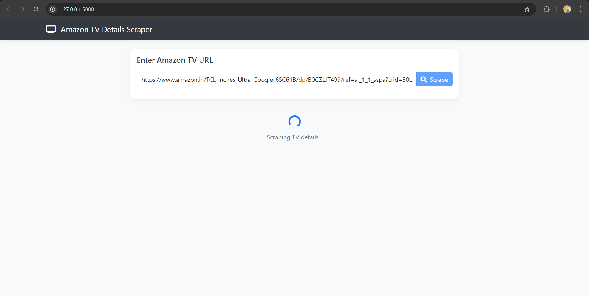
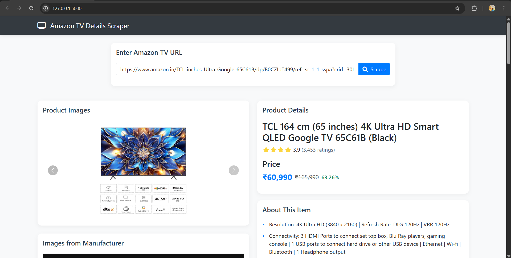
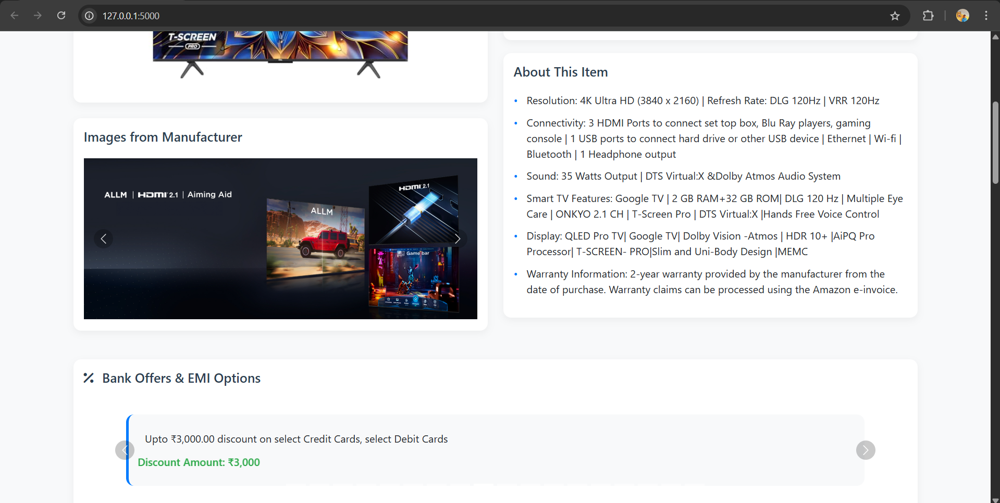
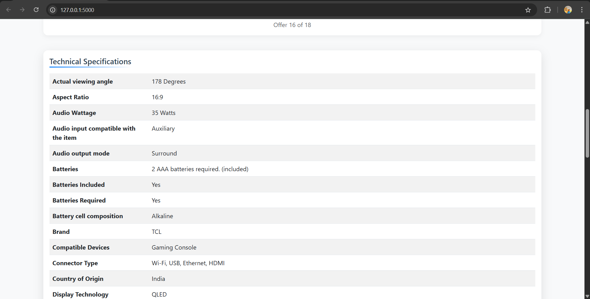
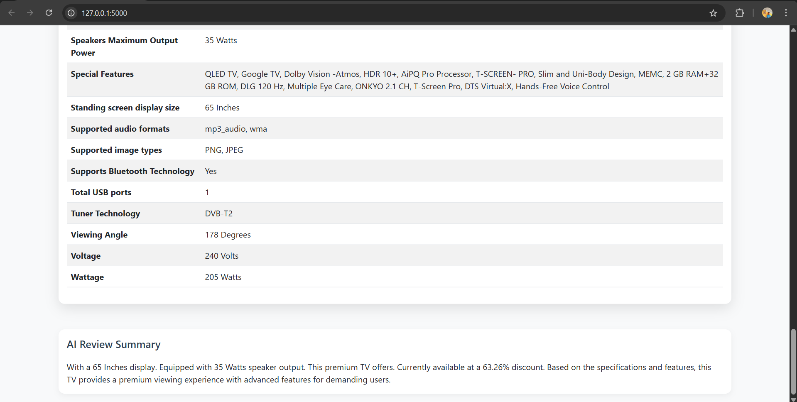

# Amazon TV Details Scraper

This project is a web scraper designed to extract detailed information about TVs listed on Amazon India. It captures product specifications, bank offers, and other relevant details, presenting them in a user-friendly interface.

## Features

- Extracts product name, rating, and number of ratings
- Captures current price, MRP, and calculated discount
- Collects all bank offers and EMI details
- Gathers complete "About this item" information
- Extracts technical specifications and product information
- Downloads product images (excluding videos)
- Captures manufacturer-provided images
- Includes AI-generated customer review summaries
- Saves all data in a structured JSON format
- **Responsive Design**: The UI is designed to be mobile-friendly, ensuring a seamless experience across devices.
- **Animations**: Includes smooth animations and transitions for a modern look and feel.
- **Error Handling**: Robust error handling to manage scraping failures gracefully.

## Screenshots

### Main Interface


_The main interface where users can enter the Amazon TV URL for scraping_

### Product Details


_Displays comprehensive product information including name, price, ratings, and discount_



### Technical Specifications


_Shows detailed technical specifications of the TV_

### Additional Information


_Displays additional product features, bank offers, and AI-generated review summary_

## Requirements

- Python 3.8 or higher
- Chrome browser installed
- Internet connection

## Installation

1. Clone this repository:

```bash
git clone [repository-url]
cd amazon-tv-scraper
```

2. Install the required packages:

   ```bash
   pip install -r requirements.txt
   ```

3. Ensure you have the Chrome browser installed, as the scraper uses Selenium with ChromeDriver.

## Usage

1.  a)To Run the scraper:

```bash
python backend/amazon_scraper.py
```

    b)To Run the application:
    ```bash
    python app.py

2. When prompted, enter the Amazon India Smart TV product URL.

3. The scraper will automatically:
   - Load the page
   - Extract all required information
   - Save the data to a JSON file with timestamp

The output file will be named `tv_details_YYYYMMDD_HHMMSS.json` in the current directory.

## Output Format

The scraper saves data in JSON format with the following structure:

```json
{
  "product_name": "string",
  "rating": "string",
  "number_of_ratings": "string",
  "selling_price": "float",
  "mrp": "float",
  "discount_percentage": "string",
  "bank_offers": ["string"],
  "about_this_item": ["string"],
  "product_information": {
    "key": "value"
  },
  "product_images": ["url"],
  "manufacturer_images": ["url"],
  "ai_review_summary": "string"
}
```

## Notes

- The scraper uses headless Chrome browser, so you won't see the browser window
- Make sure you have a stable internet connection
- Some products might not have all the information available
- The scraper respects Amazon's robots.txt and includes appropriate delays

## Error Handling

- If the URL is invalid or the page doesn't load, the scraper will display an error message
- If certain information is not available on the product page, those fields will be null in the JSON output
- The scraper includes timeout handling for slow-loading pages

## License

This project is licensed under the MIT License - see the LICENSE file for details.
